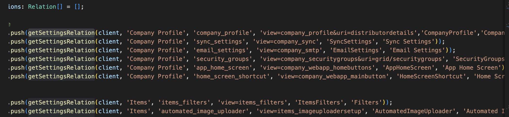
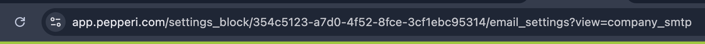
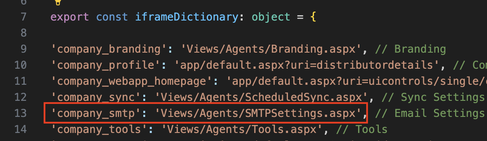
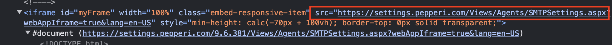
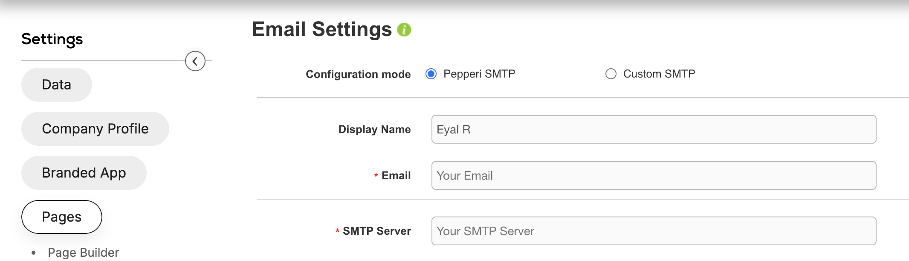

# Legacy Activities Dashboard Architecture

## Overview

- The addon was written to allow Legacy pages from the old backoffice system to work under the settings menu in the webapp.
- The addon append an iframe on the page and displays the page content from our Wsim (Backoffice old site) inside it.
- The addon add the query "webAppIframe=true" to the url, the old backoffice know to read this query and to show only the relevant parts of the page (for example: without the page menu).
- All of the logic & UI come from the Wsim backoffice system.

---

## Data Model

The addon contains 2 HTML iframes.​

- ​The first iframe, an hidden iframe, built to allow the client to plant a cookie in order to enable the login to the old Wsim system without a login from the login page.​

- The second iframe get the src property and display the page content.
- The list of the Legacy pages relations comes from the 'upsertSettingsRelation' function on the installation.ts file. the function build an array of pages relations and install those relations. 

### Example (Part of the Legacy pages relations).

    1. The first param is the relation 'GroupName' (Parent menu on the settings menu).
    2. The second is the relation 'SlugName'.
    3. The third is the relation 'QueryParams'.
    4. The fourth is the relation 'Name'.
    5. The fifth is the relation 'Description'.

## How it actually works
1. When the addon loads the desired view is taken from the url (the slug name) (addon.componnent.ts onInit function).
2. The relative path is builds from **iframeDictionary** on dictionart.ts.
3. There is a check if the user is Admin or VARAdmin. (if not show the no licance message).
4. The src is added to the iframe and display the content. 

### Example: 

The view is **company_smtp** 

The relative path builds from the iframeDictionary on dictionary.ts

The iframe get the src.

The content is loaded.

---

## PNS Usage

[Provide any PNS subscriptions or publishes done by the addon]

---

## Relations
The page contain a lot of relation, 
you can see it on the [installation.ts file](https://github.com/Pepperi-Addons/LegacySettings/blob/main/server-side/installation.ts#L65)
on **upsertSettingsRelation** function

---

## Topics

- The addon add the query "webAppIframe=true" to the url, the old backoffice know to read this query and to show only the relevant parts of the page (for example: without the page menu)
- The addon add the query "lang=${this.browserLang}" to the url, and the Activities dashboard will be display on the same languge as the webapp.
_____________________________________________________________
### CPI endpoints:

There is no CPI side.
_____________________________________________________________
#### Diagram

[Provide any diagrams relevant to topic1]
